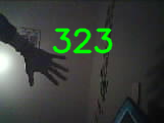
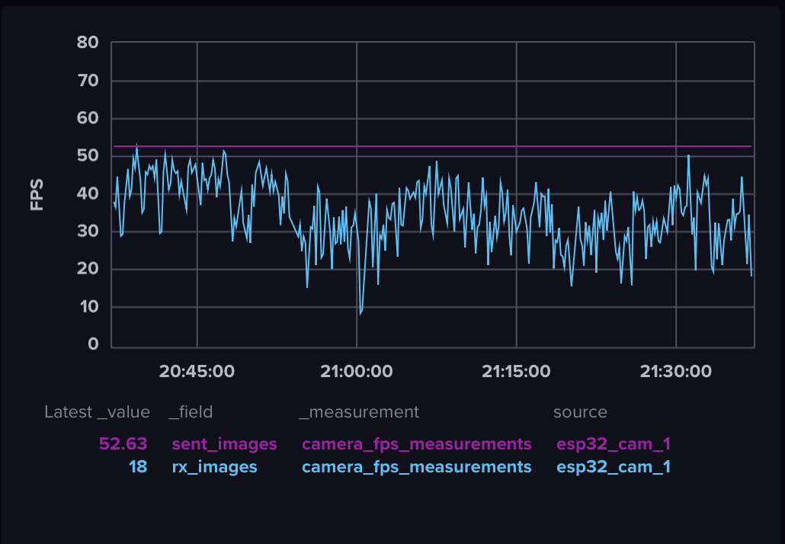

# GPhands - General Purpose hands
computer vision based hand gesture system for general purpose computer control.

## Overview

A low cost, scalable, real time system that accurately captures hand gestures––taps, pinches, twists, etc––as computer input. 

## Use Cases

Being general purpose, the use cases of this system are only bound by the imagination. Here are some examples:

* Light control - tap fingers to turn light fixture on/off. Pinch and twist to dim.
* Speaker control - tap fingers to pause/play media, pinch and twist to dim.
* Games - tap to play flappy bird, point and shoot with finger gun
* Social media control - swipe to scoll Instagram, Tiktok. Tap fingers to like

## Details

### Training Data

Above is an example of a frame transmitted by the ESP32-Cam, with a `frame_id` overlaid in green. Consider this the input image for the 
FastYOLO model. 

As you can see, our model needs to determine hand landmarks with very low resolution data as input. To fine tune the model for this, we 
will augment public hand datasets with synthetic data. 

The goal for the synthetic data is to resemble the above image as closely as possible, with the added benenfit of being automatically 
annotated. 

### Low Cost

Using ESP32-CAM (<$10) cameras as input. 

### Real Time

By using very low resolutions, grayscale colorspace, and by disabling JPEG compression on the ESP32-CAM (and instead sending raw image sensor data over WiFi), the ESP32-CAM can achieve FPS as high as 50 frames per second. Even with a 30% frame loss due to sampling errors and whatever sources, a stable framerate of 30 FPS feels achievable, which is enough for real time hand gesture capture.

On the networking side, using a dedicated 2.4Ghz network avoids signal noise from other devices when transmitting images.

On the intelligence side, the FastYOLO algorithm can achieve 50fps on a CPU, especially at low resolutions. Furthermore, the model can be fine tuned to custom datasets to achieve better performance. Since this system will be used exclusively for hand classification and gesture estimation, it seems likely to achieve real-time model performance.

### Scalable

ESP32-CAMs are low power and WiFi compatible, which allows them to be extremely modular. Using an ESP32 microcontroller as a UDP forwarder allows other cameras to be easily added to the network.

### Accurate

Genreally, the accuracy of image classification algorithms suffers at high framerates and low resolutions. This system will compensate by using multiple cameras for redundancy and creating custom, sensor-specific training datasets in Blender to optimize the YOLO model.

## TODO

- [ ] Implement FastYOLO (or mediapipe) hands into prototype

- [X] Further optimize FPS

- [X] Confirm 30 FPS is stable for 24 hours. (ESP32 calculates framerate. Send framerate in UDP header to the 
server and count frames received on server. Plot both as time series, will show when something is a framerate issue or a network issue. Can also create pie chart to show how often FPS dips below 30.)
